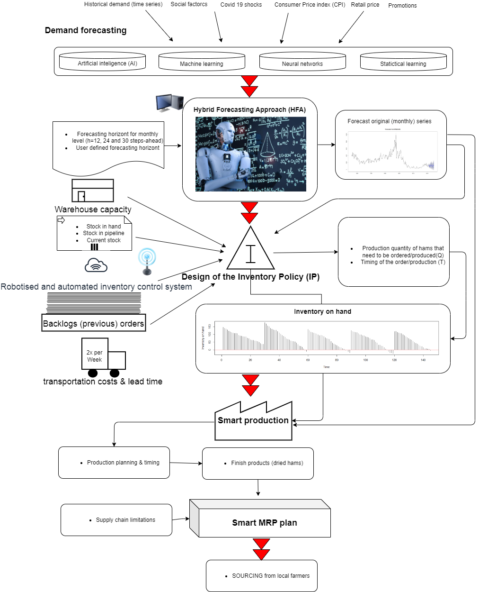

# Parma-Ham-Horizon-2020

**SMART FOOD – Supervised Production And Real-time Traceability in food distribution**, represents the winning project for the cascadilly funded **Horizon 2020** project.The project will be implemented in the [Parma-Ham](https://www.parmashop.com/en/parma-ham.html), the world largest ham producer with more than 50 000 workers.

Lead researches:

* PhD [Dejan Mircetic](https://www.linkedin.com/feed/update/urn:li:activity:6993199240374050816/)
* PhD [Marinko Maslaric](https://www.linkedin.com/in/marinko-maslaric-6058576/)

Goal: design automated AI food factory and enable agile production & logistic system.
